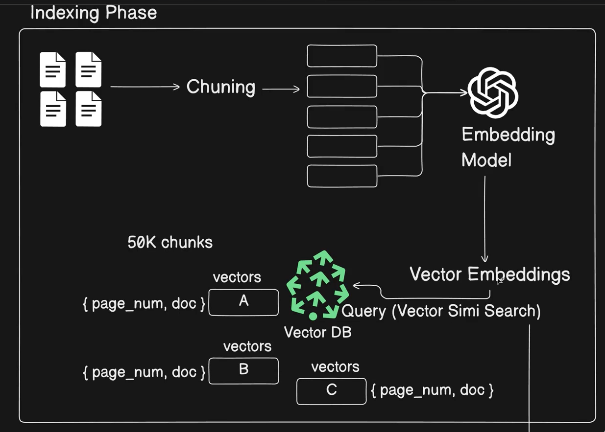
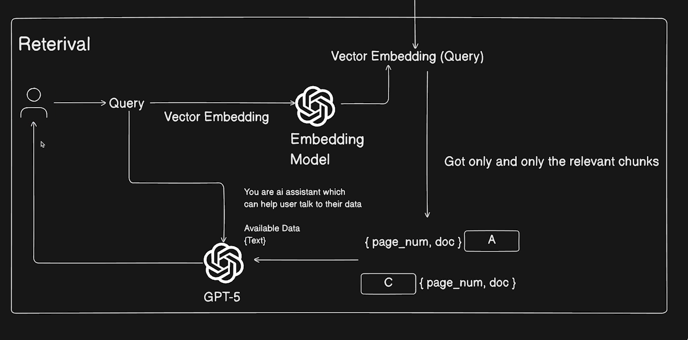

### RAG
    Retrieval Augumented Generation

## Business problems to overcome using RAG
    1. High Cost of sending large files to LLM each time when user asks any query
    2. Context window limitation(1M token window)

## Phases of RAG

    1. Indexing phase -> Provide the data(say 100s of files) --> chuncking(splitting the large data into smaller parts) the data --> provide every chuck to LLM model in a through embedding model --> vector embedding --> this will be stored into vector DB --> Vector DB stores both chuck and it's associated vector embeddings and also it's metadata(what is the page no, what is all about the document) 

    2. Retreival phase --> Chatting with data --> when user asks any question --> convert that question into vector embeddings(through vector embedding LLM model) -->  Those embeddings will to to vector DB and look for similar vector embedding againt the stored vector embeddings during the Indexing phase and do a vector similar search and provide the only the releavant chucks --> those chucks(with original data and it's metadata and remove the vector embeddings) will then passed into LLM model along with user original question(query) and then provide the answer to the user 

    

### Vector DB
1. Qdrant
2. pgvector
3. Chroma DB
4. Pinecone 
5. weaviate
